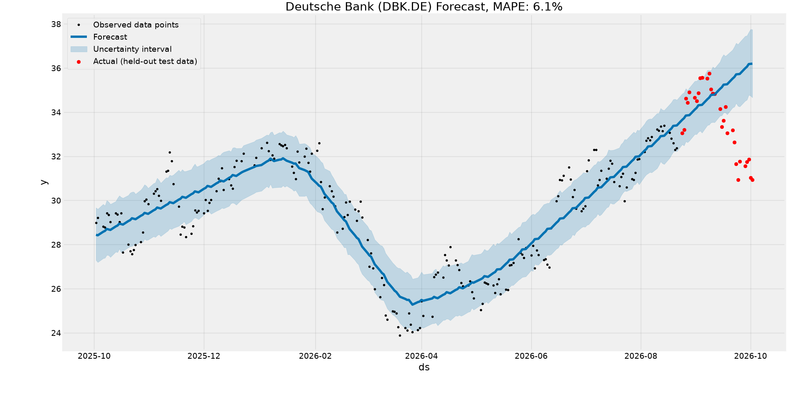

# Deutsche Bank Stock Forecast

Time-series forecast of Deutsche Bank (DBK.DE, Xetra) closing prices
using Prophet. Data from Yahoo Finance via yfinance.

- Trained on all but the last 30 trading days
- Test results: MAPE 6.07%, RMSE 2.59

   

Built following a tutorial with AI assistance. Learning project,
not financial advice.
